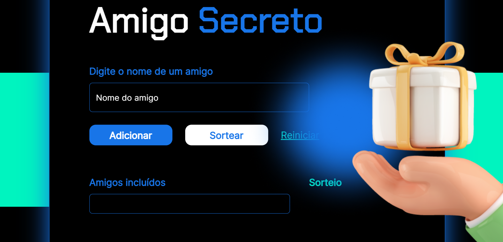

# Amigo Secreto

O projeto web se trata de um sorteador de nomes para amigo secreto.

## 🔨 Funcionalidades do projeto

Projeto desenvolvido sem fins comerciais. Especialização em javascript.

## ✔️ Técnicas e tecnologias utilizadas

-`HTML`
-`CSS`
-`Javascript`
-`Acessibilidade Web`

## 🛠️ Abrir e rodar o projeto

Para abrir e rodar o projeto, utilize um editor de código de sua escolha.
Depois, abra o projeto no seu navegador.

## VERCEL 
https://amigo-secreto-two-ashen.vercel.app/
